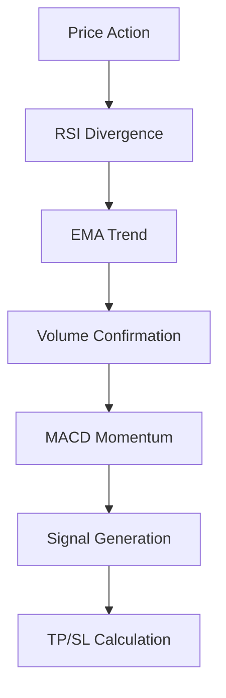

# 🚀 Scalping Master Pro

<div align="center">


### 💎 Advanced Scalping Indicator for TradingView

*Professional-grade technical analysis tool designed for high-frequency trading with advanced signal generation and risk management*

---

## 🌟 Social Media & Connect

<div align="center">

[](https://youtube.com/@quantraalgo)
[](https://twitter.com/quantraalgo)
[](https://t.me/quantraalgo)
[](https://discord.gg/quantraalgo)
[](https://instagram.com/quantraalgo)
[](https://linkedin.com/company/quantraalgo)

</div>

</div>

## 📋 Table of Contents

- [🔥 Features](#-features)
- [🎯 Key Components](#-key-components)
- [⚡ Quick Start](#-quick-start)
- [🛠️ Configuration](#️-configuration)
- [📊 Signal Logic](#-signal-logic)
- [📈 Risk Management](#-risk-management)
- [🎨 Visual Elements](#-visual-elements)
- [🔔 Alert System](#-alert-system)
- [🧪 Testing & Optimization](#-testing--optimization)
- [📝 Changelog](#-changelog)
- [🤝 Contributing](#-contributing)
- [📄 License](#-license)

## 🔥 Features

### ✨ Core Features
- 🎯 **Multi-Timeframe Analysis** - Advanced signal generation across multiple timeframes
- 📊 **RSI Divergence Detection** - Automatic bullish/bearish divergence identification
- 📈 **EMA Trend Confirmation** - Dual EMA system for trend validation
- 🌊 **Volume Spike Analysis** - Smart volume confirmation for signal reliability
- 🎛️ **MACD Momentum Filter** - Additional momentum confirmation layer
- 🎨 **Dynamic Support/Resistance** - Automatic S/R zone plotting
- 📱 **Real-time Info Dashboard** - Live market condition monitoring

### 🆕 Advanced Features
- 🎯 **Automated TP/SL Calculation** - ATR-based risk management
- ⚖️ **Risk/Reward Optimization** - Configurable R/R ratios
- 🔄 **Signal Frequency Control** - Minimum bars between signals
- 🎨 **Customizable Visuals** - Full color and display customization
- 🔔 **Smart Alert System** - Comprehensive notification system

## 🎯 Key Components

### 📊 Technical Indicators

| Component | Description | Default Settings |
|-----------|-------------|------------------|
| 📈 **RSI** | Relative Strength Index for momentum | Length: 14, OB: 70, OS: 30 |
| 🌊 **EMA Fast** | Fast Exponential Moving Average | Period: 9 |
| 🌊 **EMA Slow** | Slow Exponential Moving Average | Period: 21 |
| 📊 **Volume** | Volume spike detection | Length: 20, Multiplier: 1.5x |
| 📈 **MACD** | Moving Average Convergence Divergence | 12, 26, 9 |
| 🎯 **ATR** | Average True Range for volatility | Period: 14 |

### 🔄 Signal Generation Matrix



## ⚡ Quick Start

### 🚀 Installation

1. **Copy the Script**
   ```pinescript
   // Copy the complete Pine Script code
   ```

2. **Add to TradingView**
   - Open TradingView Pine Script Editor
   - Paste the code
   - Click "Add to Chart"

3. **Configure Settings**
   - Adjust parameters in the indicator settings
   - Set up alerts if needed

### 🎛️ Basic Setup

```pine
// Basic configuration example
rsiLen = 14          // RSI period
ema1 = 9             // Fast EMA
ema2 = 21            // Slow EMA
atrPeriod = 14       // ATR for TP/SL
slMultiplier = 1.5   // Stop Loss multiplier
riskRewardRatio = 1.5 // Take Profit ratio
```

## 🛠️ Configuration

### 📊 RSI Settings
```pinescript
rsiLen = 14    // RSI calculation period (5-25)
rsiOB = 70     // Overbought threshold (65-85)
rsiOS = 30     // Oversold threshold (15-35)
```

### 🌊 EMA Settings
```pinescript
ema1 = 9       // Fast EMA period (5-15)
ema2 = 21      // Slow EMA period (15-50)
```

### 📊 Volume Settings
```pinescript
volLen = 20    // Volume average period (10-30)
volMult = 1.5  // Volume spike multiplier (1.0-3.0)
```

### 🎯 TP/SL Settings
```pinescript
atrPeriod = 14           // ATR calculation period
slMultiplier = 1.5       // Stop Loss ATR multiplier
riskRewardRatio = 1.5    // Take Profit R/R ratio
```

### ⚙️ Signal Settings
```pinescript
minBars = 5     // Minimum bars between signals (3-15)
showTable = true // Display information table
showZones = true // Show support/resistance zones
```

## 📊 Signal Logic

### 🔵 Long (Buy) Signals
**Conditions Required:**
- ✅ **RSI Bullish Divergence** - Lower price, higher RSI
- ✅ **Uptrend Confirmation** - EMA Fast > EMA Slow, Price > EMA Fast
- ✅ **Volume Spike** - Volume > Average × Multiplier
- ✅ **MACD Bullish** - MACD Line > Signal Line, Rising Histogram
- ✅ **Strong Candle** - Body > 60% of candle range
- ✅ **Timing Filter** - Minimum bars since last signal

### 🔴 Short (Sell) Signals
**Conditions Required:**
- ✅ **RSI Bearish Divergence** - Higher price, lower RSI
- ✅ **Downtrend Confirmation** - EMA Fast < EMA Slow, Price < EMA Fast
- ✅ **Volume Spike** - Volume > Average × Multiplier
- ✅ **MACD Bearish** - MACD Line < Signal Line, Falling Histogram
- ✅ **Strong Candle** - Body > 60% of candle range
- ✅ **Timing Filter** - Minimum bars since last signal

## 📈 Risk Management

### 🎯 Automated TP/SL System

#### Long Positions
```pinescript
Stop Loss = Low - (ATR × SL Multiplier)
Take Profit = Entry + (Entry - Stop Loss) × R/R Ratio
```

#### Short Positions
```pinescript
Stop Loss = High + (ATR × SL Multiplier)
Take Profit = Entry - (Stop Loss - Entry) × R/R Ratio
```

### ⚖️ Risk Parameters

| Parameter | Default | Range | Description |
|-----------|---------|-------|-------------|
| SL Multiplier | 1.5 | 0.5-3.0 | ATR-based stop loss distance |
| R/R Ratio | 1.5 | 1.0-5.0 | Risk to reward ratio |
| ATR Period | 14 | 5-30 | Volatility calculation period |

## 🎨 Visual Elements

### 📊 Chart Elements
- **📈 EMA Lines** - Fast (cyan) and Slow (white) moving averages
- **🎯 Signal Arrows** - Buy (green up) and Sell (red down) arrows
- **🏷️ Signal Labels** - Detailed signal information with RSI values
- **📏 TP/SL Lines** - Dynamic take profit and stop loss levels
- **🎨 Trend Background** - Color-coded trend indication
- **📋 Support/Resistance** - Dynamic S/R zone plotting

### 🎛️ Information Dashboard
Real-time display showing:
- 📊 Current RSI value with color coding
- 🎯 Trend direction (UP/DOWN/NEUTRAL)
- 📊 Volume condition (HIGH/LOW)
- 📈 MACD momentum status
- 🎯 Active signal status
- 💰 Current Take Profit level
- 🛑 Current Stop Loss level

### 🎨 Color Customization
```pinescript
bullCol = #00FFBF    // Bullish signal color
bearCol = #FFFFFF    // Bearish signal color  
tpColor = #00FFBF    // Take profit color
slColor = #FFFFFF    // Stop loss color
```

## 🔔 Alert System

### 📱 Available Alerts
- **🔵 Scalp Buy Alert** - Triggered on bullish signal generation
- **🔴 Scalp Sell Alert** - Triggered on bearish signal generation

### 🎛️ Alert Configuration
```pinescript
alertcondition(buy_signal, 'Scalp Buy Alert', 
    'SCALP BUY: {{ticker}} at {{close}}')
alertcondition(sell_signal, 'Scalp Sell Alert', 
    'SCALP SELL: {{ticker}} at {{close}}')
```

### 📨 Alert Message Format
- **Ticker Symbol** - Asset being traded
- **Entry Price** - Signal generation price
- **Timestamp** - Signal generation time
- **Technical Data** - RSI value and trend info

## 🧪 Testing & Optimization

### ⚡ Performance Metrics
- **📊 Signal Accuracy** - Divergence detection precision
- **⏱️ Signal Frequency** - Configurable signal generation rate
- **🎯 Risk Management** - Automated TP/SL effectiveness
- **📈 Trend Following** - EMA-based trend identification
- **📊 Volume Confirmation** - Signal reliability enhancement

### 🔧 Optimization Tips

1. **📊 Market Conditions**
   - Trending markets: Increase EMA periods
   - Ranging markets: Decrease RSI thresholds
   - High volatility: Increase ATR multiplier

2. **⏱️ Timeframe Selection**
   - 1-5 minutes: Ultra-short scalping
   - 5-15 minutes: Standard scalping
   - 15-60 minutes: Swing scalping

3. **🎯 Risk Management**
   - Conservative: R/R = 2.0+, SL = 2.0+
   - Moderate: R/R = 1.5, SL = 1.5
   - Aggressive: R/R = 1.0, SL = 1.0

## 📝 Changelog

### Version 1.0 - Initial Release
- ✅ Multi-indicator signal generation system
- ✅ RSI divergence detection algorithm
- ✅ EMA trend confirmation mechanism  
- ✅ Volume spike analysis
- ✅ MACD momentum filtering
- ✅ Automated TP/SL calculation
- ✅ Dynamic support/resistance zones
- ✅ Real-time information dashboard
- ✅ Comprehensive alert system
- ✅ Full visual customization

## 🤝 Contributing

We welcome contributions to improve Scalping Master Pro! Here's how you can help:

### 🔧 Development
- **🐛 Bug Reports** - Submit detailed bug reports
- **💡 Feature Requests** - Suggest new functionality  
- **📝 Code Reviews** - Help review code improvements
- **📖 Documentation** - Improve documentation

### 📞 Community Support
- **💬 Discord** - Join our development community
- **🎥 YouTube** - Tutorial and strategy videos
- **📱 Telegram** - Real-time support and updates

## 🏆 Credits & Acknowledgments

### 👨‍💻 Development Team
- **QuentraAlgo** - Lead Developer & Strategy Designer
- **Community Contributors** - Feature suggestions and testing

### 🛠️ Technical Stack
- **Pine Script v6** - Core development platform
- **TradingView** - Charting and execution platform
- **Mathematical Libraries** - Technical analysis calculations

## 📄 License

This Pine Script™ code is subject to the terms of the **Mozilla Public License 2.0**

```
Mozilla Public License 2.0
https://mozilla.org/MPL/2.0/
```

### 📋 License Summary
- ✅ **Commercial Use** - Permitted
- ✅ **Modification** - Permitted  
- ✅ **Distribution** - Permitted
- ✅ **Private Use** - Permitted
- ❗ **Trademark Use** - Limited
- 📝 **Disclosure** - Source must be disclosed

---

<div align="center">

### 🌟 Star this repository if you found it helpful!

**Made with ❤️ by [QuentraAlgo](https://github.com/quantraalgo)**

*Happy Trading! 📈*

---

**⚠️ Disclaimer:** *This indicator is for educational and informational purposes only. Trading involves substantial risk of loss and is not suitable for all investors. Past performance does not guarantee future results. Please trade responsibly and never risk more than you can afford to lose.*

</div>
